# SkillOrbit — System Architecture

> End-to-end architecture reference for the SmartReco Build Challenge 2026 submission.
> Covers every major component, data flow, technology choice, usage guide, and test plan.

---

## Table of contents

1. [System overview](#1-system-overview)
2. [Technology stack](#2-technology-stack)
3. [High-level architecture](#3-high-level-architecture)
4. [Authentication & roles](#4-authentication--roles)
5. [Behavioral event tracking](#5-behavioral-event-tracking)
6. [Interest profiling](#6-interest-profiling)
7. [Recommendation agent (LangGraph)](#7-recommendation-agent-langgraph)
8. [Catalog dual-write (SQL + Qdrant)](#8-catalog-dual-write-sql--qdrant)
9. [Email delivery](#9-email-delivery)
10. [Weekly digest scheduler](#10-weekly-digest-scheduler)
11. [Database schema](#11-database-schema)
12. [Deployment topology](#12-deployment-topology)
13. [How to use](#13-how-to-use)
14. [How to test](#14-how-to-test)

---

## 1. System overview

SkillOrbit is a **behavioral AI recommendation platform** for career learning. It watches how users browse a real course catalog, builds an interest profile from their activity, retrieves relevant products via semantic search, and generates personalized learning paths with persuasive AI narratives — all grounded in actual catalog data.

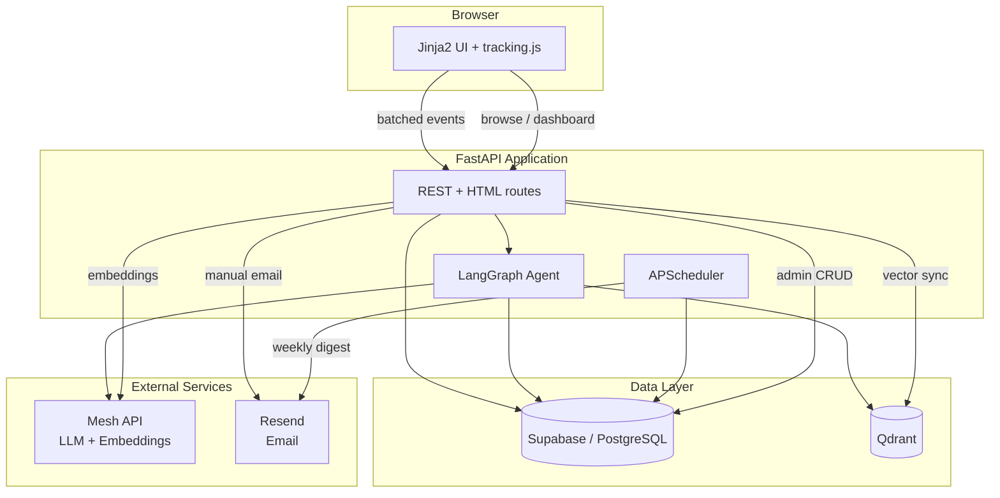

---

## 2. Technology stack

| Layer | Technology | Purpose | Key files |
|---|---|---|---|
| **Web framework** | FastAPI | Async API + route handlers | `app/main.py` |
| **Templates** | Jinja2 | Server-rendered HTML pages | `app/templates/` |
| **Frontend JS** | Vanilla JS | Event tracking, live UI, demo mode | `app/static/tracking.js`, `live.js`, `demo.js` |
| **Auth** | Supabase Auth | Email/password login, JWT sessions | `app/auth.py` |
| **Database** | Supabase (PostgreSQL) | Users, products, events, recommendations | `supabase/migrations/` |
| **Vector DB** | Qdrant | Semantic product search + RAG retrieval | `app/vector_sync.py` |
| **LLM gateway** | Mesh API | All chat + embedding calls (mandatory) | `app/recommendations.py`, `app/vector_sync.py` |
| **Agent framework** | LangGraph | Multi-stage recommendation pipeline | `app/langgraph_agent.py` |
| **Email** | Resend | Manual path emails + weekly digest | `app/email_delivery.py`, `app/digest.py` |
| **Scheduler** | APScheduler | Daily digest check at 09:00 IST | `app/scheduler.py` |
| **HTTP client** | httpx | Async calls to Supabase, Resend, Qdrant | Throughout `app/` |
| **Deployment** | Render | Production hosting | `render.yaml` |
| **CI** | GitHub Actions | SmartReco Checks + quality pipeline | `.github/workflows/` |

### Environment variables

| Variable | Required for | Service |
|---|---|---|
| `SUPABASE_URL`, `SUPABASE_ANON_KEY` | Auth, events, recommendations | Supabase |
| `SUPABASE_SERVICE_ROLE_KEY` | Weekly digest, admin seed | Supabase |
| `QDRANT_URL`, `QDRANT_API_KEY` | Semantic search, RAG | Qdrant |
| `MESH_API_KEY` | LLM narratives, embeddings | Mesh API |
| `RESEND_API_KEY`, `RESEND_FROM_EMAIL` | Email delivery | Resend |
| `CRON_SECRET` | External cron trigger | App |
| `APP_PUBLIC_URL` | Email links, share paths | App |

Full list: [`.env.example`](./.env.example)

---

## 3. High-level architecture

```mermaid
flowchart LR
    subgraph Input["User Signals"]
        PV[Page views]
        SR[Search queries]
        DW[Dwell time]
        BM[Bookmarks]
        FB[Feedback]
    end

    subgraph Processing["Backend Processing"]
        EVT[Event ingestion]
        INT[Interest profiler]
        TRG[Trigger policy]
        AGT[LangGraph agent]
    end

    subgraph Output["Outputs"]
        DASH[Dashboard path]
        TRACE[/trace observability]
        SHARE[/path share link]
        EMAIL[Email delivery]
    end

    Input --> EVT --> INT --> TRG
    TRG -->|"behavior changed"| AGT
    AGT --> DASH
    AGT --> TRACE
    AGT --> SHARE
    AGT --> EMAIL
```

### Request lifecycle (generate path)

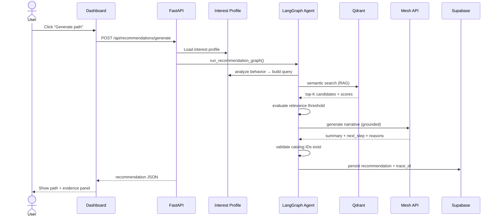

---

## 4. Authentication & roles

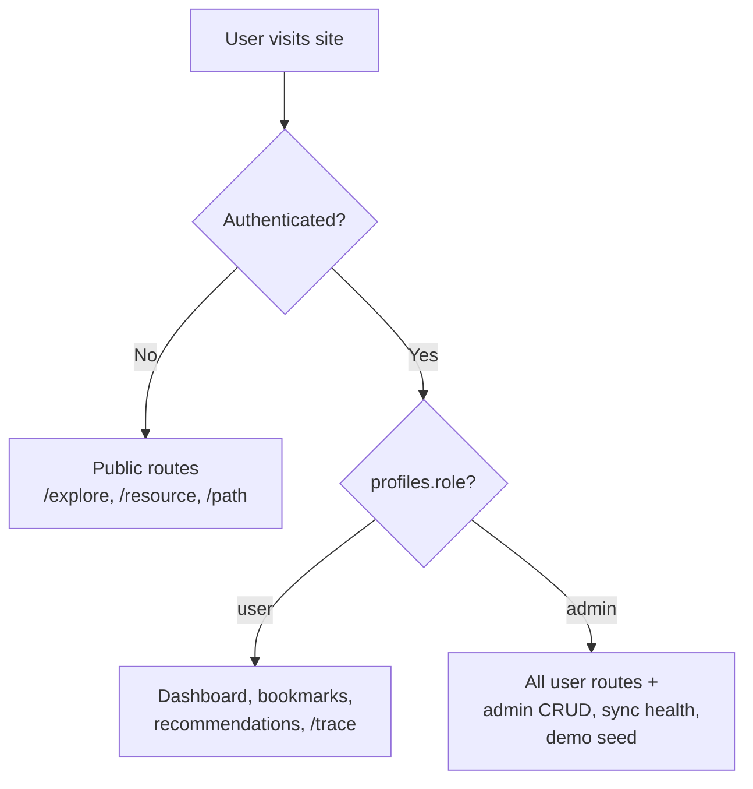

| Role | Access | Storage |
|---|---|---|
| **Anonymous** | Browse catalog, semantic search, view shared paths | No session |
| **User** | Dashboard, generate paths, bookmarks, progress, email | Supabase Auth JWT in cookie |
| **Admin** | Product CRUD, vector sync, demo seed, sync health | `profiles.role = 'admin'` |

**Implementation:** `app/auth.py` — Supabase sign-up/sign-in, session cookies, profile upsert on onboarding.

---

## 5. Behavioral event tracking

### Design principles

- **Non-blocking** — events queued in browser memory, never awaited on user actions
- **Batched** — flush at 8 events or every 5 seconds
- **Resilient** — `navigator.sendBeacon` on page hide/tab close
- **Immediate flush** — bookmark events sent instantly (high-signal)

### Event types

| Event | Trigger | Signal weight |
|---|---|---|
| `page_view` | Any authenticated page load | Low |
| `catalog_search` | Search on `/explore` | High |
| `resource_view` | Open `/resource/{id}` | High |
| `resource_dwell` | Time spent on resource page | Medium |
| `bookmark_added` | Save to library | Very high |
| `recommendation_opened` | Click from recommendation | High |
| `recommendation_feedback` | Useful / Not relevant | Very high |

### Tracking flow

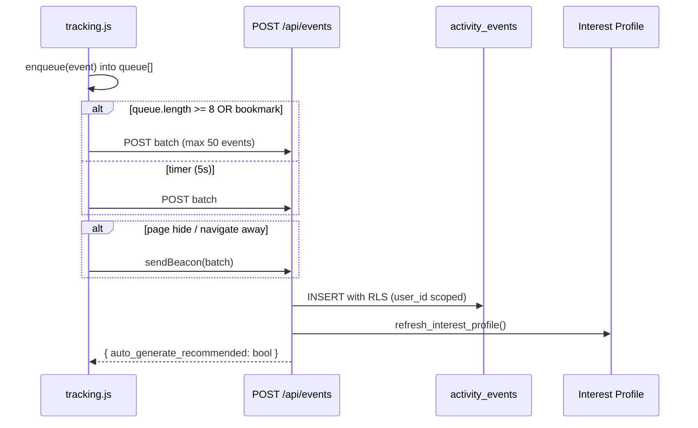

**Files:** `app/static/tracking.js` → `app/activity.py` → `app/interest.py`

---

## 6. Interest profiling

The interest profile aggregates behavioral signals into a structured learner model used by the recommendation agent.

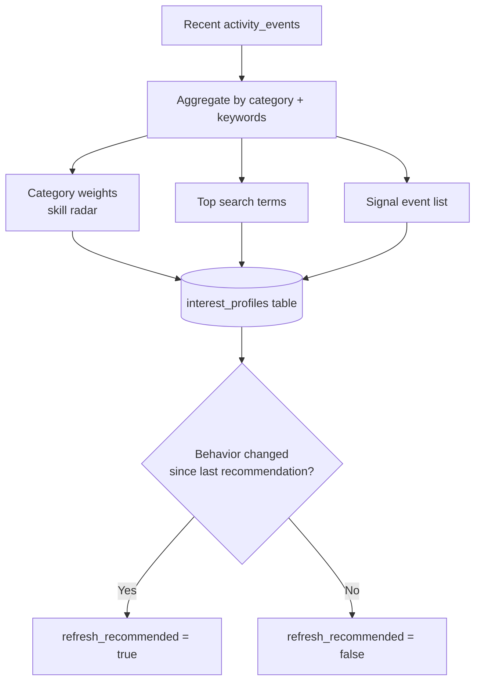

**Stored fields:** `category_weights`, `top_terms`, `signal_summary`, `refresh_recommended`, `last_refreshed_at`

**File:** `app/interest.py`

---

## 7. Recommendation agent (LangGraph)

The core of SkillOrbit — a 7-stage LangGraph pipeline that produces grounded, personalized recommendations.

### Pipeline stages

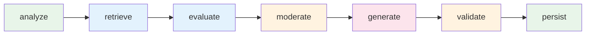

| Stage | What it does | Uses |
|---|---|---|
| **analyze** | Build semantic query from interest profile + learner goal | `interest.py` |
| **retrieve** | Qdrant vector search → top-K catalog candidates | Qdrant + Mesh embeddings |
| **evaluate** | Score threshold filter, drop low-relevance matches | Retrieval metadata |
| **moderate** | Safety check on query before LLM call | Mesh API |
| **generate** | Write summary, next_step, per-item reasons | Mesh API (grounded prompt) |
| **validate** | Verify every product ID exists in SQL catalog | Supabase |
| **persist** | Store recommendation + trace_id + retrieval_metadata | Supabase |

### AI cost control (trigger policy)

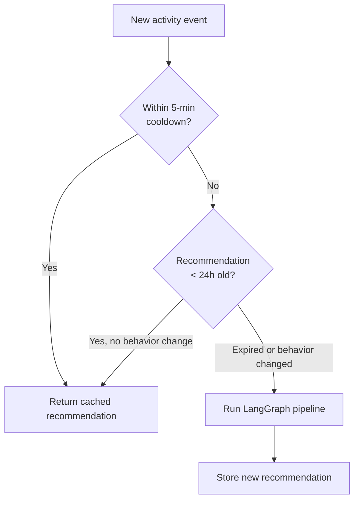

| Rule | Value | File |
|---|---|---|
| Cooldown between generations | 5 minutes | `app/triggers.py` |
| Recommendation TTL | 24 hours | `app/triggers.py` |
| Auto-generate gate | `refresh_recommended` flag | `app/triggers.py` |

### Observability

Every recommendation stores:
- `trace_id` — Mesh API trace for token inspection
- `retrieval_metadata` — top score, match count, mean score, per-candidate scores
- `change_explanation` — why the path changed vs previous recommendation

Visible at **`/trace`** in the UI.

**Files:** `app/langgraph_agent.py`, `app/recommendations.py`, `app/agent_graph.py`, `app/observability.py`

---

## 8. Catalog dual-write (SQL + Qdrant)

Every product exists in two stores that must stay in sync.

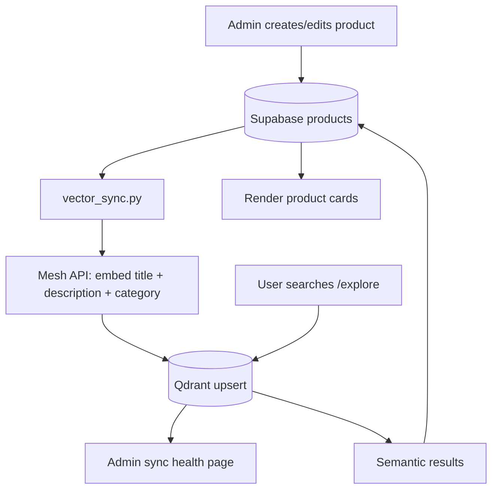

| Operation | SQL | Qdrant | Trigger |
|---|---|---|---|
| Create product | INSERT | Upsert vector | Admin form submit |
| Update product | UPDATE | Re-embed + upsert | Admin form submit |
| Delete product | Soft-delete / deactivate | Remove point | Admin delete |
| Bulk bootstrap | Read all active | Batch index | `scripts/bootstrap_qdrant.py` |

**Embedding model:** `cohere/embed-english-v3` via Mesh API
**Collection:** `skillorbit_products`

**Files:** `app/vector_sync.py`, `app/catalog.py`, `scripts/bootstrap_qdrant.py`

---

## 9. Email delivery

SkillOrbit supports two email flows — both use **Resend** as the email provider.

### 9a. Manual "Email me this path"

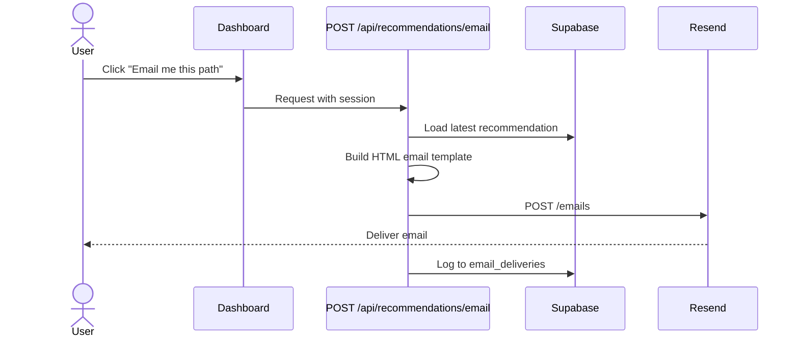

| Field | Value |
|---|---|
| Provider | Resend (`RESEND_API_KEY`) |
| From address | `RESEND_FROM_EMAIL` (e.g. `hello@plyndrox.app`) |
| Template | `recommendation_email_html()` in `app/email_delivery.py` |
| Delivery log | `email_deliveries` table (`delivery_kind = 'manual'`) |

### 9b. Weekly digest (proactive)

See [Section 10](#10-weekly-digest-scheduler) for the full scheduled flow.

| Field | Value |
|---|---|
| Provider | Resend (same API key) |
| Trigger | APScheduler + optional external cron |
| Delivery log | `email_deliveries` table (`delivery_kind = 'weekly_digest'`) |
| Duplicate guard | Checks `email_deliveries` before sending |

**Files:** `app/email_delivery.py` (manual), `app/digest.py` (weekly)

---

## 10. Weekly digest scheduler

Proactive email delivery — sends a personalized learning path recap without the user opening the site.

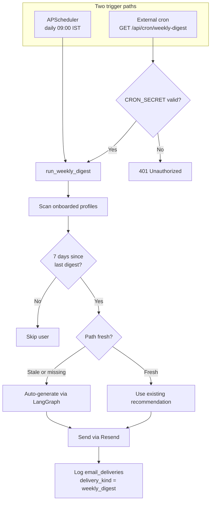

### Scheduler configuration

| Setting | Value |
|---|---|
| Engine | APScheduler (`AsyncIOScheduler`) |
| Schedule | Daily at 03:30 UTC (09:00 IST) |
| Interval | `DIGEST_INTERVAL_DAYS` (default: 7) |
| First send | 7 days after onboarding completion |
| Requires | `RESEND_API_KEY` + `SUPABASE_SERVICE_ROLE_KEY` |

### External cron (Render free tier)

For platforms that sleep, use an external monitor:

```text
GET https://YOUR-APP.onrender.com/api/cron/weekly-digest?secret=YOUR_CRON_SECRET
```

Schedule once daily (e.g. 09:05 IST via cron-job.org).

**Files:** `app/scheduler.py`, `app/digest.py`, `app/main.py` (cron endpoint)

---

## 11. Database schema

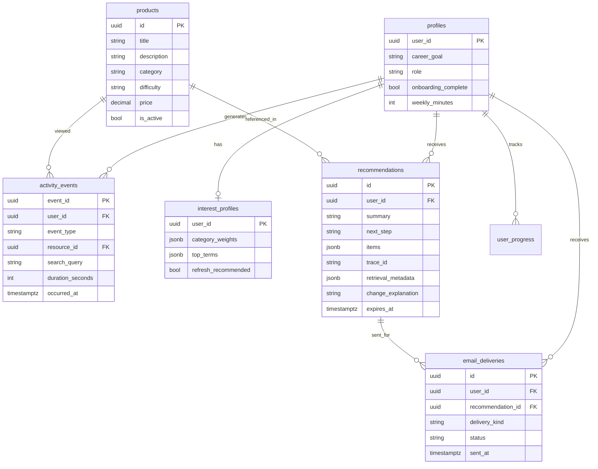

**Migrations:** `supabase/migrations/001` through `016`

---

## 12. Deployment topology

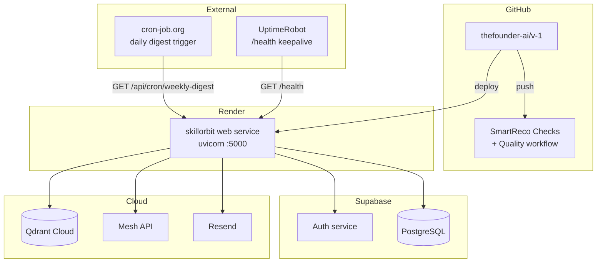

| Service | URL / Config |
|---|---|
| Production app | https://v-1-ora9.onrender.com |
| Health check | `/health` |
| Deploy config | `render.yaml` |
| Auto-deploy | Disabled (manual deploy on Render) |

---

## 13. How to use

### As a learner

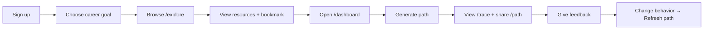

| Step | Action | URL |
|---|---|---|
| 1 | Create account | `/login` → Sign up |
| 2 | Complete onboarding | Pick career goal (e.g. AI Engineer) |
| 3 | Browse catalog | `/explore` — semantic search works without login |
| 4 | Build signals | Open resources, bookmark, search topics |
| 5 | Generate path | `/dashboard` → **Generate path** |
| 6 | Inspect pipeline | `/trace` — stages, scores, Mesh trace ID |
| 7 | Share result | **Share path** → public `/path/{id}` |
| 8 | Email yourself | **Email me this path** (requires Resend) |
| 9 | See what changed | Browse new topics → **Refresh path** → diff |

### As an admin

| Step | Action | URL |
|---|---|---|
| 1 | Set `profiles.role = 'admin'` | Supabase dashboard |
| 2 | Manage catalog | `/admin/products` |
| 3 | Add/edit/delete resources | Admin product form |
| 4 | Check vector sync | `/admin/sync-health` |
| 5 | Seed demo activity | `/demo` → Auto-run demo |

### As a judge (60-second demo)

1. Open **https://v-1-ora9.onrender.com/demo**
2. Click **Auto-run demo**
3. `/explore` → search `production RAG`
4. `/dashboard` → **Generate path**
5. `/trace` → copy Mesh trace ID
6. **Share path** → `/path/{id}`

---

## 14. How to test

### Automated tests

```bash
# Full submission verify (tests + judge audit + live smoke)
python scripts/competition_verify.py

# CI-safe (no live HTTP)
python scripts/competition_verify.py --ci

# Unit tests only
python -m unittest discover -s tests -v

# Authenticated E2E (server must be running on :5000)
uvicorn app.main:app --port 5000
python scripts/local_e2e.py
```

### Manual test matrix

| Feature | How to test | Expected result |
|---|---|---|
| **Auth** | Sign up → sign in → sign out | Session cookies work, redirect to dashboard |
| **Public explore** | `/explore` without login, search `RAG` | Semantic results from Qdrant |
| **Event tracking** | Open resource, wait 5s, check dashboard activity feed | Events appear in timeline |
| **Interest profile** | Browse 3+ resources in same category | Skill radar updates on dashboard |
| **Generate path** | Dashboard → Generate path | Summary + grounded items + trace ID |
| **Trace page** | `/trace` after generation | 7 pipeline stages, Qdrant scores |
| **Refresh diff** | Search new topic → Refresh path | "What changed" explanation appears |
| **Share path** | Click Share path | Public `/path/{id}` loads without login |
| **Feedback** | Click Useful / Not relevant | Feedback stored, profile updates |
| **Admin CRUD** | Add product → index vectors | Appears in explore search |
| **Dual-write** | `/admin/sync-health` | SQL count matches Qdrant count |
| **Manual email** | Email me this path | Email arrives via Resend |
| **Weekly digest** | `GET /api/cron/weekly-digest?secret=...` | Returns `{ sent: N }` count |
| **Health** | `GET /health` | `{ status: "ok", mesh: true, vector: true }` |

### Test scripts reference

| Script | Purpose |
|---|---|
| `scripts/competition_verify.py` | Full submission self-check |
| `scripts/local_e2e.py` | Authenticated smoke test against local server |
| `scripts/demo_seed.py` | Seed demo activity for judge walkthrough |
| `scripts/bootstrap_qdrant.py` | Index all catalog products into Qdrant |

### CI workflows

| Workflow | Trigger | What it checks |
|---|---|---|
| `smartreco-checks.yml` | Every push | Official hackathon checks (compile, deps, Mesh) |
| `quality.yml` | Push to main | `competition_verify.py --ci` + unit tests |

---

## File map (quick reference)

```
app/
├── main.py              # All routes (API + HTML)
├── auth.py              # Supabase auth + sessions
├── activity.py          # Event ingestion
├── interest.py          # Interest profiling
├── triggers.py          # AI call gating
├── recommendations.py   # RAG + narrative + persistence
├── langgraph_agent.py   # LangGraph 7-stage pipeline
├── agent_graph.py       # Pipeline state + stage logging
├── vector_sync.py       # Dual-write to Qdrant
├── catalog.py           # Product CRUD queries
├── email_delivery.py    # Manual email via Resend
├── digest.py            # Weekly digest batch sender
├── scheduler.py         # APScheduler cron
├── observability.py     # Structured logging + trace IDs
├── path_health.py       # Recommendation diff intelligence
├── bookmarks.py         # Saved library
├── progress.py          # Streak + weekly minutes
├── demo_service.py      # Judge demo auto-run
├── config.py            # Settings from .env
├── static/tracking.js   # Frontend event capture
└── templates/           # Jinja2 HTML pages
```

---

Built for SmartReco 2026 · [README](./README.md) · [Live Demo](https://v-1-ora9.onrender.com)
