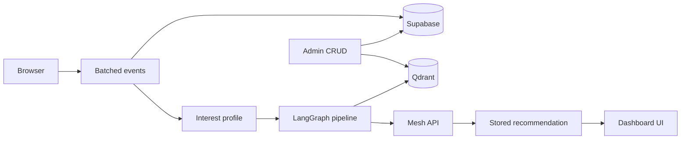

# SkillOrbit

SkillOrbit is an AI Career Learning Navigator for the **SmartReco Build Challenge 2026**. It turns real browsing activity into a grounded, explainable next learning step.

## SmartReco submission checklist

| Requirement | Implementation |
|---|---|
| FastAPI + Jinja2 | `app/main.py`, `app/templates/` |
| Mesh API for all LLM/embeddings | `app/vector_sync.py`, `app/recommendations.py` |
| Recommendation system | Qdrant RAG + interest profile + stored paths |
| Vector DB (queried) | Qdrant semantic search on `/explore` |
| Dual-write catalog | Supabase `products` + Qdrant upsert on admin CRUD |
| Behavioral tracking | Batched `app/static/tracking.js` → `/api/events` |
| Official CI | `.github/workflows/smartreco-checks.yml` |
| LangGraph agent | `app/langgraph_agent.py` orchestrates the pipeline |

### GitHub secrets (required)

In **Settings → Secrets and variables → Actions**, add:

- `MESH_API_KEY` — your Mesh API key (`rsk_...`)
- `SUBMISSION_TOKEN` — from the Krishnaik hackathon dashboard

Push to `main` and confirm the **SmartReco Checks** workflow passes.

### Judge demo (60 seconds)

1. `/explore` → search **production RAG** (public catalog)
2. Sign up → pick **AI Engineer** goal
3. Open resources, bookmark one, mark complete
4. **Dashboard** → interest radar + streak + weekly minutes
5. Generate path → **Trace** page + evidence panel
6. Change behavior → **Refresh path** → show **What changed** diff
7. Admin → add resource → index vectors → appears in search

Full script: `python scripts/demo_seed.py` and [`DEMO_RUNBOOK.md`](./DEMO_RUNBOOK.md).

## Architecture



## Bonus features

- **LangGraph workflow** — `analyze → retrieve → evaluate → generate → validate → persist` (`app/langgraph_agent.py`)
- **Recommendation diff** — before/after on dashboard and `/recommendations`
- **Skill radar** — category weights on dashboard
- **Saved library** — `/bookmarks` from real `bookmark_added` events
- **Progress tracker** — `user_progress` + streak + weekly minutes vs goal
- **Weekly digest** — APScheduler + Resend (`app/digest.py`, needs `SUPABASE_SERVICE_ROLE_KEY`)
- **Trace UI** — `/trace` with retrieval scores and pipeline stages
- **Mesh observability** — trace IDs + link to [Mesh dashboard](https://developers.meshapi.ai)
- **Live activity panel** on resource pages (real events)

## Mesh observability

Every recommendation stores a `trace_id` and `retrieval_metadata` (top score, match count, mean score).
Judges can open `/trace` for the full pipeline story or inspect token usage in the Mesh API dashboard.
Structured JSON logs include `recommendation_graph_finished` events with per-stage timings.

## Current status

- Migrations `001`–`014` (catalog ~80 resources after `014`)
- Public `/explore` and `/resource/{id}`; login for dashboard, bookmarks, recommendations
- Deploy via [`render.yaml`](./render.yaml) (set `SUPABASE_SERVICE_ROLE_KEY` for digests)

## Run locally

```bash
python -m venv .venv
.venv\Scripts\activate
pip install -r requirements.txt
copy .env.example .env
uvicorn app.main:app --reload --host 0.0.0.0 --port 5000
```

## Supabase setup

1. Enable email/password auth.
2. Run migrations `001` through `014` in order.
3. Set `profiles.role = 'admin'` for admin accounts.
4. Configure Qdrant + Mesh (+ optional Resend) in `.env`.
5. `python scripts/bootstrap_qdrant.py` after seeding catalog.

Demo seed: `python scripts/demo_seed.py --apply` (requires `DEMO_USER_EMAIL` + service role key).

## Product principles

- Recommendations are **grounded** — catalog IDs validated before display.
- **No fake cart** — honest save/bookmark + progress instead of stub e-commerce.
- External resources are **linked with attribution** only.
- Tracking is **batched and non-blocking**.

Built for SmartReco 2026 · Powered by Mesh API
