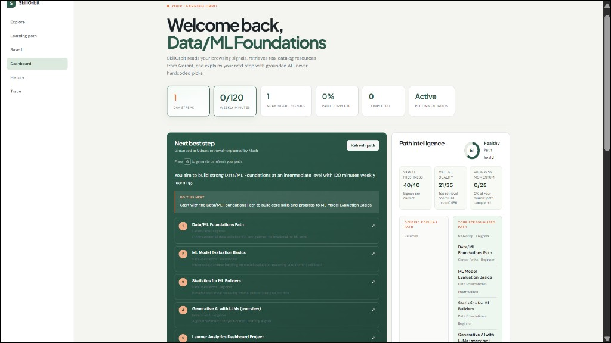
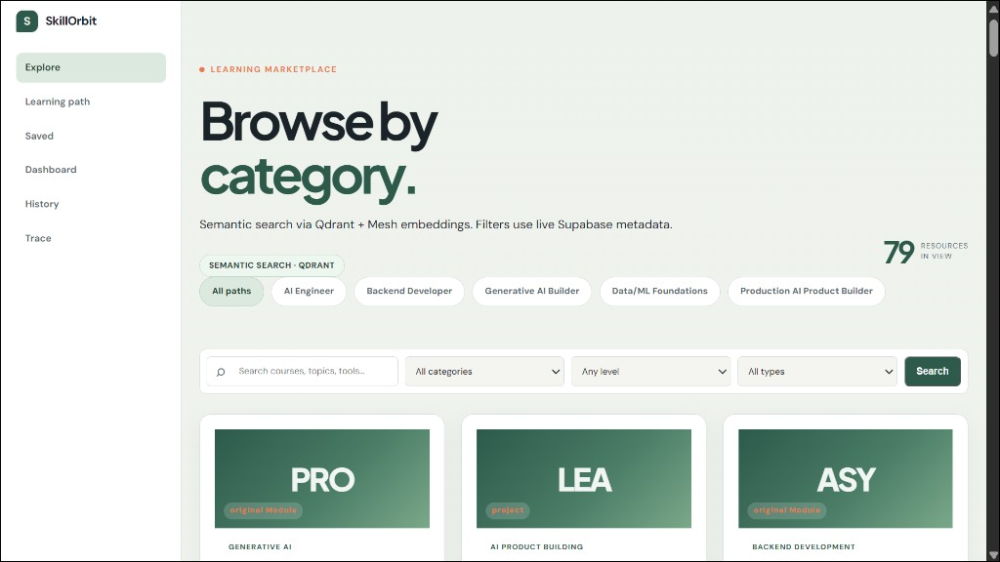
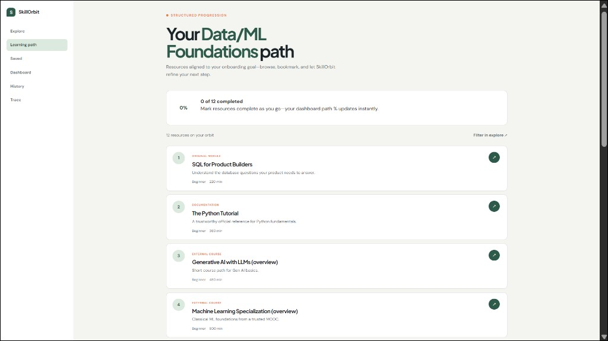
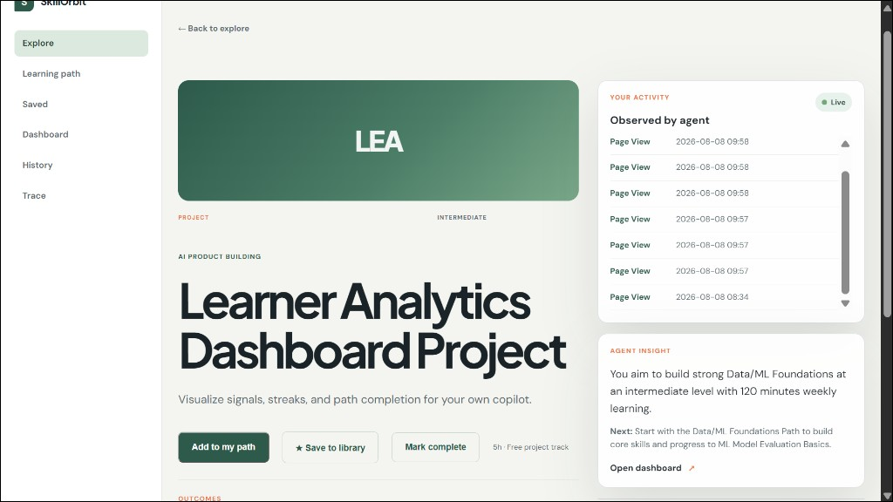
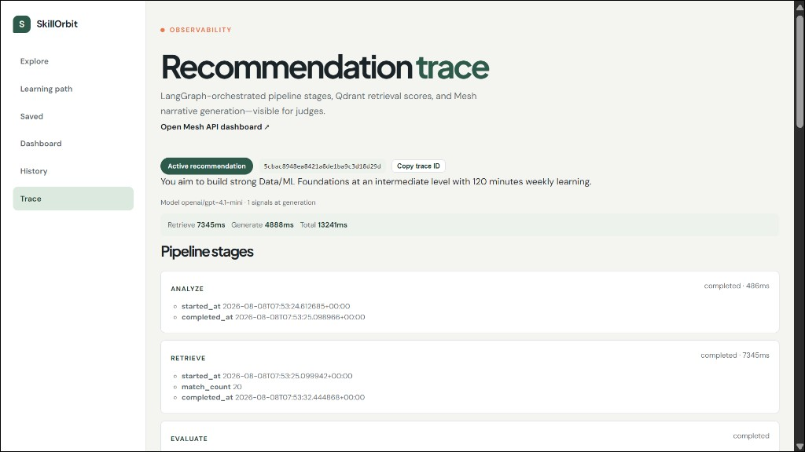
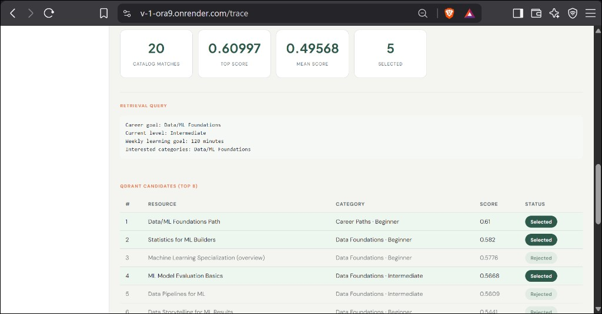
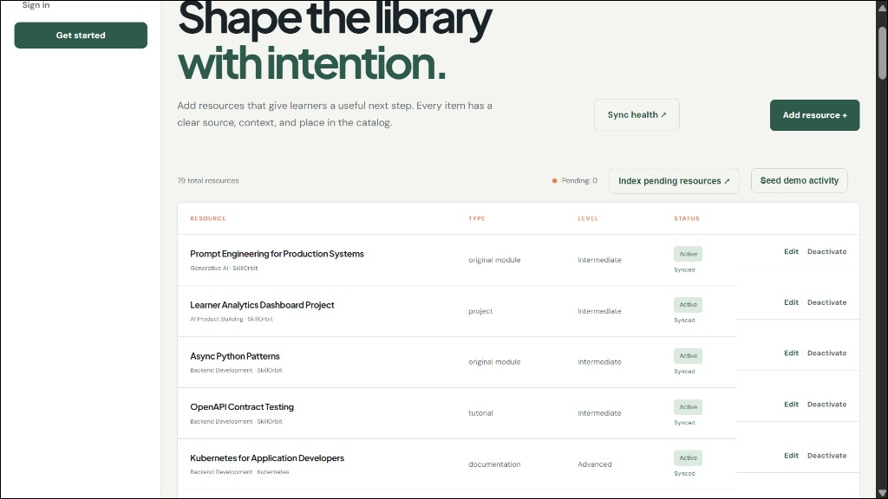
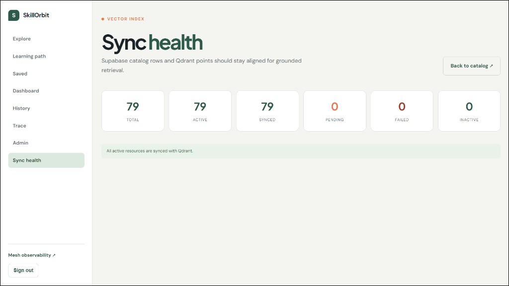
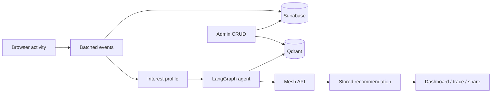

# SkillOrbit

**Behavioral AI recommendation engine for career learning.**

SkillOrbit observes how learners browse, search, and engage with a real course catalog — then reasons over that activity to deliver grounded, personalized learning paths with persuasive AI-generated narratives. Every recommendation is tied to actual catalog products retrieved via semantic search, not hallucinated content.

Built for the [SmartReco Build Challenge 2026](https://career.krishnaik.in/dashboard/hackathons?h=smartreco-build-challenge-2026).

**Documentation:** [`docs/`](./docs/README.md) — setup, user guide, API, deployment · [`ARCHITECTURE.md`](./ARCHITECTURE.md) — system design

---

## Live

| | |
|---|---|
| **Application** | https://v-1-ora9.onrender.com |
| **Judge demo** | https://v-1-ora9.onrender.com/demo |
| **Health** | https://v-1-ora9.onrender.com/health |

Open `/demo` for a guided walkthrough with auto-run. Sign up with any email, choose **AI Engineer** during onboarding, then generate a path from the dashboard.

---

## Platform preview

Real screenshots from the live app — click through what judges should see.

### Dashboard & AI path
Grounded recommendations with path intelligence, health score, and comparison vs generic paths.



### Semantic explore
79+ resources with Qdrant semantic search, career goal filters, and live Supabase metadata.



### Learning path & progress
Structured resources aligned to your career goal with completion tracking.



### Live activity tracking
Real-time page views and agent insight on every resource — batched, non-blocking events.



### LangGraph trace & Qdrant scores
Full pipeline observability with retrieval scores, selected vs rejected candidates.

| Trace pipeline | Qdrant candidates |
|---|---|
|  |  |

### Admin dual-write & sync health
Catalog CRUD writes to Supabase + Qdrant. Sync health confirms zero drift.

| Admin catalog | Vector sync |
|---|---|
|  |  |

Also see: [Bookmarks](./docs/preview/bookmarks.png) · [Recommendation history](./docs/preview/history.png)

**Live preview gallery:** [v-1-ora9.onrender.com/#preview](https://v-1-ora9.onrender.com/#preview)

---

## How it works



1. **Track** — Frontend captures page views, searches, clicks, dwell time, and bookmarks. Events are batched and flushed asynchronously so the UI never blocks.
2. **Profile** — Backend aggregates activity into a weighted interest profile with category signals and a refresh trigger when behavior shifts.
3. **Retrieve** — A LangGraph pipeline builds a semantic query from the profile, searches Qdrant, and evaluates candidate relevance before any LLM call.
4. **Generate** — Mesh API writes a short narrative and next-step recommendation grounded strictly in retrieved catalog items.
5. **Deliver** — Results are stored, shown on the dashboard, shareable at `/path/{id}`, traceable at `/trace`, and optionally emailed via weekly digest.

**Agent pipeline:** `analyze → retrieve → evaluate → moderate → generate → validate → persist`

---

## Challenge requirements

| Requirement | Implementation |
|---|---|
| FastAPI + Jinja2 | `app/main.py`, `app/templates/` |
| Email/password auth (user + admin) | Supabase Auth + `profiles.role` |
| Product catalog + admin CRUD | Admin UI with full create/edit/delete |
| Dual-write (SQL + vector DB) | Supabase `products` + Qdrant upsert on every admin change |
| Behavioral event tracking | `app/static/tracking.js` → `POST /api/events` (batched, non-blocking) |
| Agentic recommendation engine | `app/langgraph_agent.py` — RAG + personalized narrative |
| Mesh API (all LLM/embeddings) | `app/recommendations.py`, `app/vector_sync.py` |
| Efficient AI triggering | `app/triggers.py` — cooldown, TTL, behavior-change gates |
| CI workflow | `.github/workflows/smartreco-checks.yml` |

**Bonus features:** LangGraph orchestration · APScheduler weekly digest · `/trace` observability with Mesh trace IDs · recommendation diff on behavior change · retrieval score evaluation

---

## Tech stack

| Layer | Choice |
|---|---|
| Backend | FastAPI, Python 3.11 |
| Frontend | Jinja2 templates, vanilla JavaScript |
| Database | Supabase (PostgreSQL) |
| Vector DB | Qdrant |
| LLM / embeddings | Mesh API (OpenAI-compatible gateway) |
| Agent framework | LangGraph |
| Scheduling | APScheduler |
| Email | Resend |
| Deployment | Render |

---

## Getting started

### Prerequisites

- Python 3.11+
- Supabase project with email/password auth enabled
- Qdrant cluster
- Mesh API key (`rsk_...`)

### Setup

```bash
git clone https://github.com/thefounder-ai/v-1.git
cd v-1
python -m venv .venv
.venv\Scripts\activate        # Windows
pip install -r requirements.txt
copy .env.example .env        # fill in your keys
```

Run Supabase migrations `001` through `016` in order, then start the server:

```bash
uvicorn app.main:app --reload --host 0.0.0.0 --port 5000
```

Index the catalog into Qdrant:

```bash
python scripts/bootstrap_qdrant.py
```

Set `profiles.role = 'admin'` in Supabase for admin access.

### Verify

```bash
python scripts/competition_verify.py --ci
```

---

## Project structure

```
app/
  main.py              # Routes and request handlers
  langgraph_agent.py   # Agent orchestration (LangGraph)
  recommendations.py   # RAG retrieval, narrative generation, persistence
  vector_sync.py       # Dual-write: SQL catalog → Qdrant vectors
  activity.py          # Event ingestion and storage
  interest.py          # Behavioral interest profiling
  triggers.py          # AI call gating (cooldown, TTL, refresh policy)
  static/tracking.js   # Non-blocking frontend event capture
  templates/           # Server-rendered UI
scripts/
  competition_verify.py   # Submission self-check
  bootstrap_qdrant.py     # Vector index sync
  demo_seed.py            # Demo activity seeder
  local_e2e.py            # Authenticated smoke test
supabase/migrations/   # Schema + seed data (001–016)
tests/                 # Unit tests
.github/workflows/     # SmartReco Checks + quality CI
```

---

## Demo walkthrough

**60 seconds for judges:**

1. Open `/demo` → **Auto-run demo** (seeds activity automatically).
2. `/explore` → search `production RAG` → semantic results from Qdrant.
3. `/dashboard` → interest radar → **Generate path**.
4. `/trace` → LangGraph stages, retrieval scores, Mesh trace ID.
5. **Share path** → public `/path/{id}` → **Export PDF**.

**Show behavior-driven refresh:** browse a different topic, return to dashboard, **Refresh path** → **What changed** diff appears.

**Show dual-write (admin):** add a resource → index vectors → it appears in explore search within seconds.

---

## Production design

| Concern | Approach |
|---|---|
| Event tracking | Batched (8 events or 5 s), `sendBeacon` on page hide, immediate flush on bookmarks |
| AI cost control | 5-minute cooldown, 24-hour recommendation TTL, regenerate only on meaningful behavior change |
| Grounded output | Catalog IDs validated before display; LLM writes narrative from retrieved candidates only |
| Observability | `trace_id` + `retrieval_metadata` stored per recommendation; full pipeline visible at `/trace` |
| Proactive delivery | Weekly digest via APScheduler + optional cron endpoint; auto-generates path if stale |
| Dual-write sync | Admin CRUD writes to Supabase and Qdrant atomically; sync health page for drift detection |

---

## Environment variables

See [`.env.example`](./.env.example) for the full list. Required for core features:

| Variable | Purpose |
|---|---|
| `SUPABASE_URL`, `SUPABASE_ANON_KEY` | Auth and database |
| `QDRANT_URL`, `QDRANT_API_KEY` | Semantic retrieval |
| `MESH_API_KEY` | LLM and embeddings (mandatory) |

Optional: `RESEND_API_KEY` (email), `SUPABASE_SERVICE_ROLE_KEY` (digest cron), `CRON_SECRET` (external scheduler).

---

## GitHub Actions

Add repository secrets under **Settings → Secrets → Actions**:

- `MESH_API_KEY`
- `SUBMISSION_TOKEN`

Push to `main` to trigger SmartReco Checks automatically.

---

Built for SmartReco 2026 · Powered by [Mesh API](https://developers.meshapi.ai)
