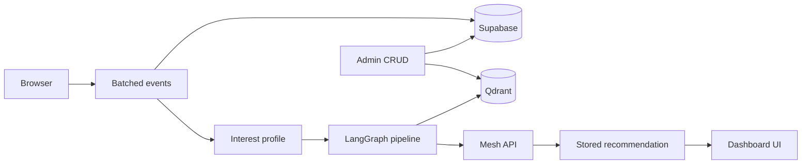

# SkillOrbit

SkillOrbit is an AI Career Learning Navigator for the **SmartReco Build Challenge 2026**. It turns real browsing activity into a grounded, explainable next learning step.

## Live demo & submission

| Resource | Link |
|----------|------|
| **Live app** | https://v-1-ora9.onrender.com |
| **Health check** | https://v-1-ora9.onrender.com/health |
| **Judge demo mode** | https://v-1-ora9.onrender.com/demo |
| **Demo video** | _Add your 2–3 min Loom/YouTube link here after recording_ |
| **Demo walkthrough** | [`DEMO_RUNBOOK.md`](./DEMO_RUNBOOK.md) |

**Demo account:** Sign up with any email, choose **AI Engineer** during onboarding, then use **Admin → Seed demo activity** (or `python scripts/demo_seed.py --apply` with `DEMO_USER_EMAIL`). For judges: open `/demo` → **Auto-run demo** when signed in as admin.

**Pre-submit verify:**

```bash
python scripts/competition_verify.py        # full: tests + judge audit + live smoke
python scripts/competition_verify.py --ci   # CI-safe (no live HTTP)
python scripts/local_e2e.py               # authenticated E2E (uvicorn on :5000)
```

## SmartReco submission checklist

| Requirement | Implementation |
|---|---|
| FastAPI + Jinja2 | `app/main.py`, `app/templates/` |
| Mesh API for all LLM/embeddings | `app/vector_sync.py`, `app/recommendations.py` |
| Recommendation system | Qdrant RAG + interest profile + stored paths |
| Vector DB (queried) | Qdrant semantic search on `/explore` |
| Dual-write catalog | Supabase `products` + Qdrant upsert on admin CRUD |
| Behavioral tracking | Batched `app/static/tracking.js` → `/api/events` |
| Official CI | `.github/workflows/smartreco-checks.yml` |
| LangGraph agent | `app/langgraph_agent.py` orchestrates the pipeline |

### GitHub secrets (required)

In **Settings → Secrets and variables → Actions**, add:

- `MESH_API_KEY` — your Mesh API key (`rsk_...`)
- `SUBMISSION_TOKEN` — from the Krishnaik hackathon dashboard

Push to `main` and confirm the **SmartReco Checks** workflow passes.

### Judge demo (60 seconds)

Open **`/demo`** for guided judge mode with auto-run, or follow manually:

1. `/explore` → search **production RAG** (public catalog)
2. Sign up → pick **AI Engineer** goal
3. Open resources, bookmark one, mark complete
4. **Dashboard** → interest radar + streak + weekly minutes
5. Generate path → **Share path** (`/path/{id}`) + **Trace** page + evidence panel
6. Change behavior → **Refresh path** → show **What changed** diff
7. Admin → **Seed demo activity** or add resource → index vectors → appears in search

Full script: **`/demo`**, `python scripts/demo_seed.py`, and [`DEMO_RUNBOOK.md`](./DEMO_RUNBOOK.md).

## Architecture



## Bonus features

- **LangGraph workflow** — `analyze → retrieve → evaluate → generate → validate → persist` (`app/langgraph_agent.py`)
- **Recommendation diff** — before/after on dashboard and `/recommendations`
- **Skill radar** — category weights on dashboard
- **Saved library** — `/bookmarks` from real `bookmark_added` events
- **Progress tracker** — `user_progress` + streak + weekly minutes vs goal
- **Weekly digest** — every 7 days via APScheduler + `/api/cron/weekly-digest` (Resend + service role key)
- **Trace UI** — `/trace` with retrieval scores and pipeline stages
- **Mesh observability** — trace IDs + link to [Mesh dashboard](https://developers.meshapi.ai)
- **Judge demo mode** — `/demo` guided overlay + auto-run
- **Shareable paths** — public `/path/{id}` + print-friendly PDF export
- **Live activity panel** on resource pages (real events)

## Mesh observability

Every recommendation stores a `trace_id` and `retrieval_metadata` (top score, match count, mean score).
Judges can open `/trace` for the full pipeline story or inspect token usage in the Mesh API dashboard.
Structured JSON logs include `recommendation_graph_finished` events with per-stage timings.

**Judge workflow**

1. Generate a path on the dashboard → copy the Mesh trace ID from the evidence panel.
2. Open `/trace` for LangGraph stages, Qdrant candidate table, and pipeline timings.
3. Paste the trace ID into the [Mesh dashboard](https://developers.meshapi.ai) to inspect token usage.
4. Share `/path/{recommendation_id}` for a public, PII-free snapshot; use **Export PDF** for print.


## Current status

- Migrations `001`–`015` (catalog ~80 resources; `015` adds `delivery_kind` for weekly digests)
- Public `/explore` and `/resource/{id}`; login for dashboard, bookmarks, recommendations
- Deploy via [`render.yaml`](./render.yaml) (set `SUPABASE_SERVICE_ROLE_KEY` for digests)

## Run locally

```bash
python -m venv .venv
.venv\Scripts\activate
pip install -r requirements.txt
copy .env.example .env
uvicorn app.main:app --reload --host 0.0.0.0 --port 5000
```

## Supabase setup

1. Enable email/password auth.
2. Run migrations `001` through `015` in order.
3. Set `profiles.role = 'admin'` for admin accounts.
4. Configure Qdrant + Mesh (+ optional Resend) in `.env`.
5. `python scripts/bootstrap_qdrant.py` after seeding catalog.

Demo seed: `python scripts/demo_seed.py --apply` or Admin → **Seed demo activity** (requires `DEMO_USER_EMAIL` + service role key).

## Weekly digest (automatic email)

Manual **Email me this path** is instant. The **weekly digest** runs without the user opening the site:

1. User finished onboarding (path **not** required beforehand).
2. **7 days** after onboarding (then every 7 days), on that send day SkillOrbit:
   - runs a **daily check** (scheduler + optional cron URL),
   - refreshes learner signals,
   - **only if the path is not latest** (missing, expired, or behavior changed), auto-generates a new AI path,
   - emails the result from `hello@plyndrox.app`.
3. APScheduler checks daily at **09:00 IST** (03:30 UTC).
4. For Render free tier, also schedule an external cron hit:

```text
GET https://YOUR-APP.onrender.com/api/cron/weekly-digest?secret=YOUR_CRON_SECRET
```

Use [cron-job.org](https://cron-job.org) once per day (e.g. 09:05 IST). Use [UptimeRobot](https://uptimerobot.com) every 5 minutes on `/health` to reduce cold starts.

Render env vars: `RESEND_API_KEY`, `RESEND_FROM_EMAIL`, `SUPABASE_SERVICE_ROLE_KEY`, `CRON_SECRET`, optional `DIGEST_INTERVAL_DAYS=7`.

Run Supabase migration `015_email_delivery_kind.sql` before enabling weekly digests.

## Product principles

- Recommendations are **grounded** — catalog IDs validated before display.
- **No fake cart** — honest save/bookmark + progress instead of stub e-commerce.
- External resources are **linked with attribution** only.
- Tracking is **batched and non-blocking**.

Built for SmartReco 2026 · Powered by Mesh API
