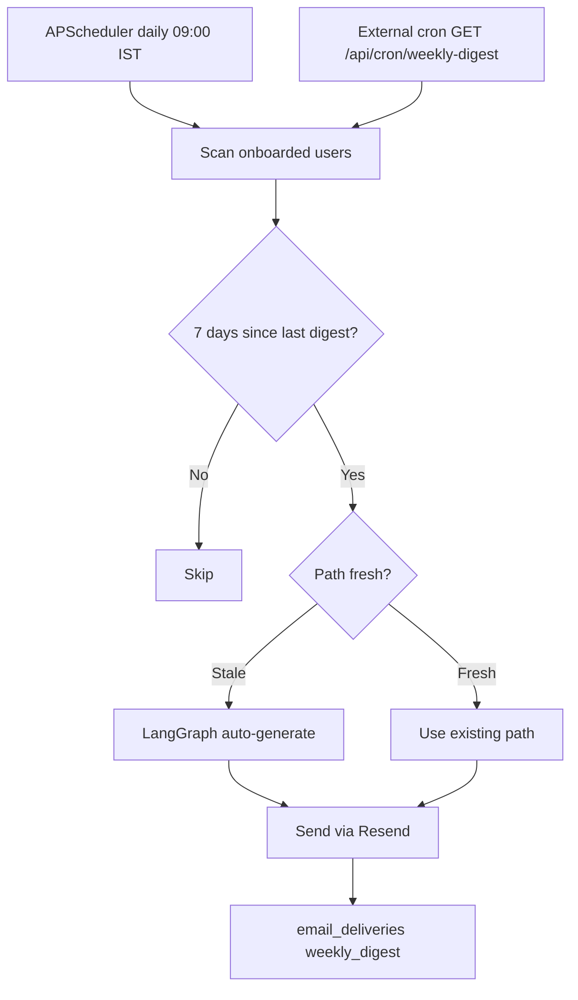

# Deployment Guide

Production deployment on Render with email, cron, and monitoring.

---

## Render deployment

### Configuration

Deployment is defined in [`render.yaml`](../render.yaml):

```yaml
services:
  - type: web
    name: skillorbit
    runtime: python
    buildCommand: pip install -r requirements.txt
    startCommand: uvicorn app.main:app --host 0.0.0.0 --port ${PORT:-5000}
    healthCheckPath: /health
```

**Live URL:** https://v-1-ora9.onrender.com

### Environment variables (Render dashboard)

Set these under **Environment** in the Render service settings:

| Variable | Required | Notes |
|---|---|---|
| `APP_ENV` | Yes | `production` |
| `APP_PUBLIC_URL` | Yes | `https://v-1-ora9.onrender.com` |
| `SUPABASE_URL` | Yes | |
| `SUPABASE_ANON_KEY` | Yes | |
| `SUPABASE_SERVICE_ROLE_KEY` | Yes | Digest + demo seed + share paths |
| `QDRANT_URL` | Yes | |
| `QDRANT_API_KEY` | Yes | |
| `MESH_API_KEY` | Yes | |
| `RESEND_API_KEY` | Optional | Email features |
| `RESEND_FROM_EMAIL` | Optional | Verified domain in Resend |
| `CRON_SECRET` | Optional | External cron authentication |
| `DIGEST_INTERVAL_DAYS` | Optional | Default `7` |

### Deploy steps

1. Connect GitHub repo to Render.
2. Set all environment variables.
3. **Manual Deploy** → Deploy latest commit.
4. Verify: `curl https://v-1-ora9.onrender.com/health`

> `autoDeploy` is disabled in `render.yaml` — deploy manually after each push.

---

## Supabase production config

1. **Site URL:** `https://v-1-ora9.onrender.com`
2. **Redirect URLs:** `https://v-1-ora9.onrender.com/**`
3. Run all migrations `001`–`016`.
4. Set admin role for demo account.

---

## Qdrant production

1. Use Qdrant Cloud (not local).
2. Run bootstrap after first deploy:

```bash
# Locally with production .env
python scripts/bootstrap_qdrant.py
```

3. Verify at `/admin/sync-health` — all active resources should show **Synced**.

---

## Email delivery

### Manual "Email me this path"

| Component | Config |
|---|---|
| Provider | Resend |
| Trigger | User clicks button on dashboard |
| Endpoint | `POST /api/recommendations/{id}/email` |
| Log | `email_deliveries` table, `delivery_kind = 'manual'` |

### Requirements

```env
RESEND_API_KEY=re_...
RESEND_FROM_EMAIL=SkillOrbit <hello@yourdomain.com>
```

Sender domain must be verified in Resend dashboard.

---

## Weekly digest

Automatic proactive email every 7 days after onboarding.

### How it works



### Internal scheduler

APScheduler runs inside the app process:

- **Schedule:** Daily at 03:30 UTC (09:00 IST)
- **File:** `app/scheduler.py`
- **Requires:** `RESEND_API_KEY` + `SUPABASE_SERVICE_ROLE_KEY`

### External cron (Render free tier)

Render free tier sleeps after inactivity. Use an external cron to:

1. Keep the app awake.
2. Trigger digest as backup.

**Setup with [cron-job.org](https://cron-job.org):**

```
URL:    https://v-1-ora9.onrender.com/api/cron/weekly-digest?secret=YOUR_CRON_SECRET
Method: GET
Schedule: Daily at 09:05 IST
```

### Uptime monitoring

Use [UptimeRobot](https://uptimerobot.com) to ping `/health` every 5 minutes — reduces cold start delays for judges.

```
Monitor URL: https://v-1-ora9.onrender.com/health
Interval:    5 minutes
```

---

## GitHub Actions CI

### Required secrets

| Secret | Purpose |
|---|---|
| `MESH_API_KEY` | SmartReco automated checks |
| `SUBMISSION_TOKEN` | Hackathon dashboard token |

### Workflows

| File | Trigger | What it does |
|---|---|---|
| `smartreco-checks.yml` | Every push | Official hackathon checks |
| `quality.yml` | Push to main | `competition_verify.py --ci` + unit tests |

### Fix red X on SmartReco Checks

If checks pass but show red:

1. Submit the hackathon entry form on the [Krishnaik dashboard](https://career.krishnaik.in/dashboard/hackathons?h=smartreco-build-challenge-2026).
2. Re-run the workflow from GitHub Actions.

---

## Production checklist

```
[ ] All env vars set on Render
[ ] Supabase migrations 001–016 applied
[ ] Supabase Site URL = production URL
[ ] Qdrant bootstrap run (79 synced)
[ ] /health returns all "configured"
[ ] Sign up + onboarding works
[ ] Generate path works (Mesh + Qdrant)
[ ] /trace shows pipeline stages
[ ] Admin CRUD + sync health OK
[ ] GitHub secrets set (MESH_API_KEY, SUBMISSION_TOKEN)
[ ] Hackathon dashboard form submitted
[ ] UptimeRobot on /health
[ ] cron-job.org on /api/cron/weekly-digest (optional)
[ ] Demo video link on hackathon dashboard
```

---

## Monitoring

| What | Where |
|---|---|
| App health | `GET /health` |
| Vector sync | `/admin/sync-health` |
| Pipeline trace | `/trace` |
| Mesh token usage | [Mesh dashboard](https://developers.meshapi.ai) |
| Email deliveries | Supabase `email_deliveries` table |
| CI status | GitHub Actions tab |

---

Next: [Setup Guide](./SETUP.md) · [User Guide](./USER_GUIDE.md)
