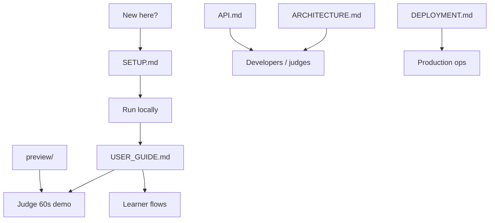

# SkillOrbit Documentation

Welcome to the SkillOrbit documentation. This folder contains everything you need to understand, run, test, and demo the platform.

## Quick links

| Document | Description |
|---|---|
| [**Setup Guide**](./SETUP.md) | Local install, Supabase, Qdrant, Mesh API, first run |
| [**User Guide**](./USER_GUIDE.md) | Learner, admin, and judge walkthroughs |
| [**API Reference**](./API.md) | REST endpoints, events schema, auth |
| [**Deployment**](./DEPLOYMENT.md) | Render, cron, email, production checklist |
| [**Architecture**](../ARCHITECTURE.md) | System design, diagrams, data flows (root) |
| [**Platform Preview**](./preview/) | Screenshots of every major screen |

## Live resources

| Resource | URL |
|---|---|
| Application | https://v-1-ora9.onrender.com |
| Judge demo | https://v-1-ora9.onrender.com/demo |
| Preview gallery | https://v-1-ora9.onrender.com/#preview |
| Health check | https://v-1-ora9.onrender.com/health |
| GitHub repo | https://github.com/thefounder-ai/v-1 |

## What is SkillOrbit?

SkillOrbit is a **behavioral AI recommendation engine** for career learning, built for the [SmartReco Build Challenge 2026](https://career.krishnaik.in/dashboard/hackathons?h=smartreco-build-challenge-2026).

It watches how users browse a real course catalog, builds an interest profile from their activity, retrieves relevant products via semantic search (Qdrant), and generates personalized learning paths with persuasive narratives (Mesh API) — every recommendation grounded in actual catalog data.

## Documentation map



## SmartReco requirements coverage

| Requirement | Doc section |
|---|---|
| FastAPI + Jinja2 | [Architecture](../ARCHITECTURE.md#2-technology-stack) |
| Auth (user + admin) | [User Guide — Roles](./USER_GUIDE.md#roles) |
| Behavioral tracking | [API — Events](./API.md#behavioral-events) |
| Dual-write catalog | [User Guide — Admin](./USER_GUIDE.md#admin-guide) |
| Agentic recommendations | [Architecture — LangGraph](../ARCHITECTURE.md#7-recommendation-agent-langgraph) |
| Mesh API | [Setup — Mesh](./SETUP.md#mesh-api) |
| Email + weekly digest | [Deployment — Email](./DEPLOYMENT.md#email-delivery) |

## Verify your installation

```bash
python scripts/competition_verify.py --ci
python scripts/local_e2e.py          # requires uvicorn on :5000
```

---

Built for SmartReco 2026 · [Main README](../README.md)
