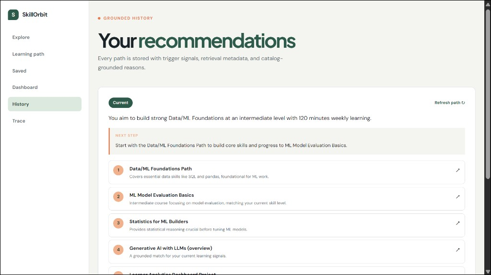
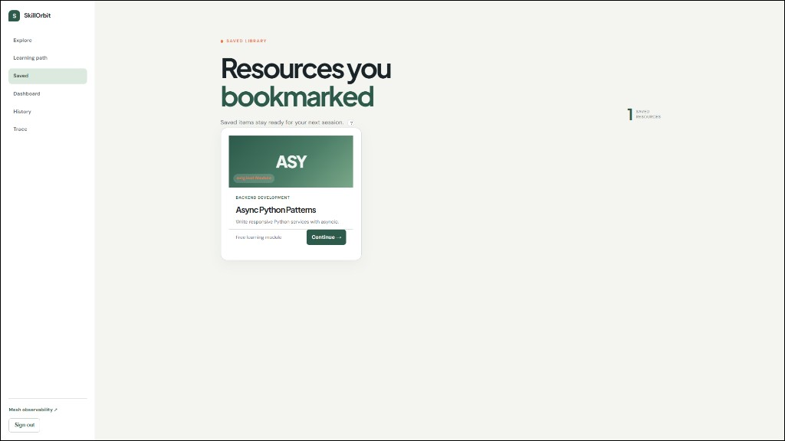

# User Guide

How to use SkillOrbit as a learner, admin, or hackathon judge.

---

## Roles

| Role | How to get it | Access |
|---|---|---|
| **Anonymous** | No account | `/explore`, `/resource/{id}`, shared `/path/{id}` |
| **Learner** | Sign up + onboarding | Dashboard, bookmarks, recommendations, trace |
| **Admin** | `profiles.role = 'admin'` in Supabase | All learner routes + admin CRUD, sync health, demo seed |

---

## Learner guide

### Step 1 — Create account

1. Go to `/signup`.
2. Enter email and password.
3. Complete onboarding: pick a **career goal** (e.g. AI Engineer) and weekly learning minutes.

### Step 2 — Explore the catalog

- Open `/explore` — works without login.
- Search semantically (e.g. `production RAG`, `async python`).
- Filter by category, difficulty, content type, or career goal.
- Click any resource to view details.


### Step 3 — Build behavioral signals

While logged in, SkillOrbit tracks your activity automatically:

| Action | What it signals |
|---|---|
| Search on explore | Topic interest |
| Open a resource | Category interest |
| Stay on page 10+ seconds | Dwell time (engagement) |
| Bookmark a resource | Strong interest boost |
| Mark complete | Progress signal |
| Give feedback (Useful / Not relevant) | Direct preference |

Events are **batched and non-blocking** — the UI never waits for tracking.


### Step 4 — Generate your path

1. Open `/dashboard`.
2. Review your stats: streak, weekly minutes, meaningful signals.
3. Click **Generate path** (or press `G`).
4. Read your personalized summary, next best step, and grounded resource list.


### Step 5 — Inspect and share

| Action | Where |
|---|---|
| View pipeline trace | `/trace` |
| Copy Mesh trace ID | Evidence panel on dashboard |
| Share publicly | **Share path** → `/path/{id}` |
| Export PDF | **Export PDF** on share page |
| Email yourself | **Email me this path** (requires Resend) |
| See history | `/recommendations` |


### Step 6 — Refresh when behavior changes

1. Browse a different topic (e.g. switch from RAG to backend).
2. Return to dashboard → **Refresh path**.
3. See **What changed** — diff between old and new recommendation.



### Other learner pages

| Page | URL | Purpose |
|---|---|---|
| Learning path | `/learning-path` | Structured goal-aligned resources + completion % |
| Bookmarks | `/bookmarks` | Saved library from bookmark events |
| History | `/recommendations` | All past recommendations with metadata |




---

## Admin guide

### Catalog management

1. Go to `/admin/products`.
2. **Add resource** — title, description, category, difficulty, price, URL.
3. Every create/update **dual-writes** to Supabase + Qdrant automatically.
4. **Index pending** — batch-index any products missing vectors.
5. **Deactivate** — soft-delete; removes from search.


### Sync health

Open `/admin/sync-health` to verify SQL ↔ Qdrant alignment:

| Metric | Meaning |
|---|---|
| Total | All catalog rows |
| Active | Currently searchable |
| Synced | Indexed in Qdrant |
| Pending | Awaiting vector index |
| Failed | Index errors |


### Demo seed

For judge presentations:

- **UI:** Admin → **Seed demo activity**
- **CLI:** `python scripts/demo_seed.py --apply` (set `DEMO_USER_EMAIL`)

Seeds realistic browsing events so Generate path works immediately.

---

## Judge guide (60 seconds)

Use this script for hackathon evaluation:

```
1. Open  /demo  →  click "Auto-run demo"
2. Open  /explore  →  search "production RAG"
3. Open  /dashboard  →  click "Generate path"
4. Open  /trace  →  copy Mesh trace ID, show Qdrant scores
5. Click "Share path"  →  open public /path/{id}
```

### What to verify

| Check | How |
|---|---|
| Behavioral tracking | DevTools → Network → `POST /api/events` (batched) |
| Semantic search | `/explore` returns Qdrant results, not keyword-only |
| Grounded output | Every recommended item has a real catalog ID |
| LangGraph agent | `/trace` shows 7 pipeline stages with timings |
| Mesh API | Trace ID works in Mesh dashboard |
| Dual-write | Admin add resource → appears in explore search |
| No hallucination | Product titles match actual catalog entries |
| Efficient AI | Re-generate within 5 min returns cached result |

### Guided demo mode

`/demo` provides a step-by-step overlay with auto-run for admins. No manual setup required if demo seed is configured.

### Screenshot gallery

Browse all screens at: https://v-1-ora9.onrender.com/#preview

Or see [`docs/preview/`](./preview/) for static images.

---

## Keyboard shortcuts

| Key | Action | Page |
|---|---|---|
| `G` | Generate or refresh path | Dashboard |

---

## FAQ

**Q: Do I need an account to browse?**
No. `/explore` and `/resource/{id}` work anonymously. Personalized features require login.

**Q: How often does the AI regenerate?**
Only when behavior meaningfully changes, with a 5-minute cooldown and 24-hour TTL. See `app/triggers.py`.

**Q: Are recommendations real or fake?**
Every item is retrieved from Qdrant and validated against the SQL catalog before display. The LLM only writes the narrative.

**Q: How does weekly email work?**
7 days after onboarding, APScheduler checks if your path is stale and emails a fresh recommendation via Resend. See [Deployment](./DEPLOYMENT.md#weekly-digest).

---

Next: [API Reference](./API.md) · [Architecture](../ARCHITECTURE.md)
